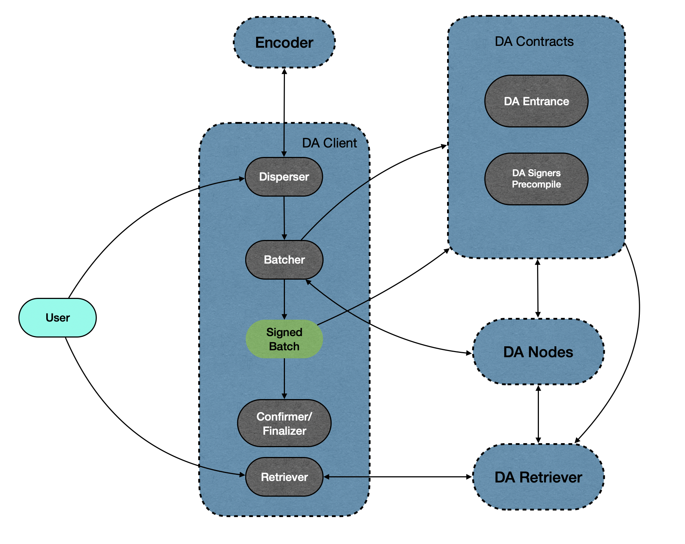

# 0G DA

## Organization

The 0G DA consists of multiple different modules: DA Contracts, DA Nodes and DA Client. The DA Client can be further divided into client, encoder, and retriever.

DA Contracts maintain the upload and verification status of DA data on-chain in the form of smart contracts, it also maintains information about DA signers and conducts signer elections through on-chain VRF.

DA Nodes are operated by DA Signers. They are responsible for encoding verification, signing DA data, and earning rewards through storage mining.

DA users need the DA Client to access DA services. The DA Client receives data uploaded by users and sends it to the Encoder for erasure coding. Then it sends the encoded data to DA Nodes to obtain signatures. After aggregating enough signatures, it confirms the upload on-chain to complete the DA data upload process. The DA Client also receives requests from users to retrieve data and forwards these requests to the Retriever to fetch data from DA nodes.

## Terminology

**Blob:** Blobs are the fundamental unit of data posted to 0G DA by users.

For terms about signers, see [here](<../0G Chain/Precompiles/DASigners.md#terminology>).

## Architecture

<figure><figcaption>
Figure 1. Architecture Overview
</figcaption></figure>

## Workflow

### Upload data

1. User upload data to Disperser module of DA Client;
2. The DA client sends data to the encoder, obtaining encoded data and the corresponding encoding proof;
3. DA Client upload the merkle root of encoded data to DA Entrance contract, the contract assigns a quorum to sign the uploaded data;
4. DA Client send the encoded data to DA nodes in assigned quorum, obtain the signatures and aggregate them;
5. DA Client upload the aggregated signature to DA Entrance contract, the contract verifies the signature and store the verified data commitment root.

### Download data

1. User request DA Client to retrieve an uploaded and verified DA data;
2. DA Client forwards the retrieve request to DA Retriever;
3. Retriever reads the states on chain stored in DA Entrance contract to find the assigned quorum of the data;
4. Retriever request encoded rows from DA nodes in the assigned quorum, then recover the original data from encoded rows.