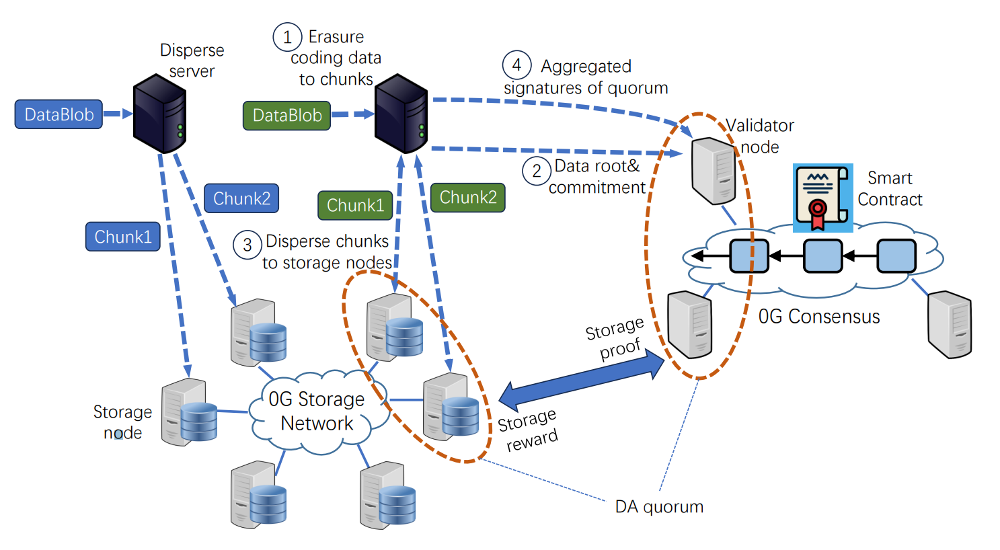

# Architecture

## 0G System

0G system consists of a data availability layer (0G DA) on top of a decentralized storage system (0G Storage). There are one or multiple separate consensus networks that are part of both the 0G DA and the 0G Storage. For 0G Storage, each consensus network is responsible for determining the ordering of the uploaded data blocks, realizing the storage mining verification and the corresponding incentive mechanism through smart contract. For 0G DA, the consensus is in charge of guaranteeing the data availability property of each data block via verifying the aggregated signatures from the corresponding data availability quorum.

Figure 1 illustrates the architecture of the 0G system when deploying a single consensus network. When a data block enters the 0G DA, it is first erasure coded and organized into multiple consecutive chunks through erasure coding. The merkle root as a commitment of the encoded data block is then submitted to the consensus layer to keep the order of the data entering the system. The chunks are then dispersed to different storage nodes in a quorum in 0G Storage. The storage nodes periodically participate the mining process by interacting with the consensus network to accrue rewards from the system. The DA client then collects the aggregated signatures from the quorum and submits the signatures to the consensus for verification.

<figure><figcaption>
Figure 1 The architecture of 0G system
</figcaption></figure>

When deployed with multiple POS-based consensus networks, each validator participates in the maintenance of all the consensus networks by using a shared staking status. The shared staking status can be recorded in a smart contract on one of the multiple consensus networks or a blockchain network outside of the 0G consensus network set, e.g. Ethereum. Assuming $$C_0$$ is the consensus network that maintains the shared staking status, the token $$T_0$$ on $$C_0$$ would be staked for POS voting. When token $$T_i$$ is produced on network $$C_i(i \neq 0)$$ via incentives, it can be mapped to $$T_0$$ on $$C_0$$ by burning $$T_i$$ on $$C_i$$ through a secure cross-chain bridge channel. When a validator maintains the POS protocol in any network $$C_i$$, it always uses the amount of staked $$T_0$$ on $$C_0$$ as its voting power in $$C_i$$. Therefore, all the network $$C_i$$ share the same level of POS security. By using Ethereum as network $$C_0$$, it brings the benefit of incarnating the token $$T_0$$ as a standard ERC20 token and also enables the easy integration with existing popular restaking framework like EigenLayer. Note that, the sources of the shared staking status may also come from the high value tokens (e.g., BTC and ETH) in restaking frameworks like EigenLayer and Babylon, so that to make 0G consensus reach the Bitcoin or Ethereum level of security. As illustrated in Figure 2, this shared staking design introduces the unlimited scalability to 0G system.

<figure><figcaption>
Figure 2 The infinite scalability of 0G system
</figcaption></figure>

## 0G Storage

0G Storage employs layered design targetting to support different types of decentralized applications. Figure 2 shows the overview of the full stack layers of 0G Storage.

<figure><figcaption>
Figure 2. Full Stack Solution of 0G Storage
</figcaption></figure>

The lowest is a log layer that is a decentralized system. It consists of multiple storage nodes to form a storage network. The network has built-in incentive mechanism to reward the data storage. The ordering of the uploaded data is guaranteed by a sequencing mechanism to provide a log-based semantics and abstraction. This layer is used to store unstructured raw data for permanent persistency.

On top of the log layer, 0G Storage provides a Key-Value store runtime to manage structured data with mutability. Multiple key-value store nodes share the underlying log system. They put the structured key-value data structure into the log entry and append to the log system. They play the log entries in the shared log to construct the consistent state snapshot of the key-value store. The throughput and latency of the key-value store are bounded by the log system, so that the efficiency of the log layer is critical to the performance of the entire system. The key-value store can associate access control information with the keys to manage the update permission for the data. This enables the applications like social network, e.g., decentralized Twitter, which requires the maintenance for the ownership of the messages created by the users.

0G Storage further provides transactional semantics on the key-value store runtime to enable concurrent updates for the keys from multiple users who have the write access permission. The total order of the log entries guaranteed by the underlying log system provides the foundation for the concurrency control of the transactional executions on top of the key-value store. With this capability, 0G Storage can support decentralized applications like collaborative editing and even database workloads.

## Dependencies

The 0G Storage Node is depended by the [0G Storage KV](https://github.com/0glabs/0g-storage-kv). 0G Storage KV is essentially a wrapper layer on top of 0G Storage Node in order to provide mutable KV Store and transaction processing to applications. 0G DA uses the KV Store to store metadata of the data blobs.
