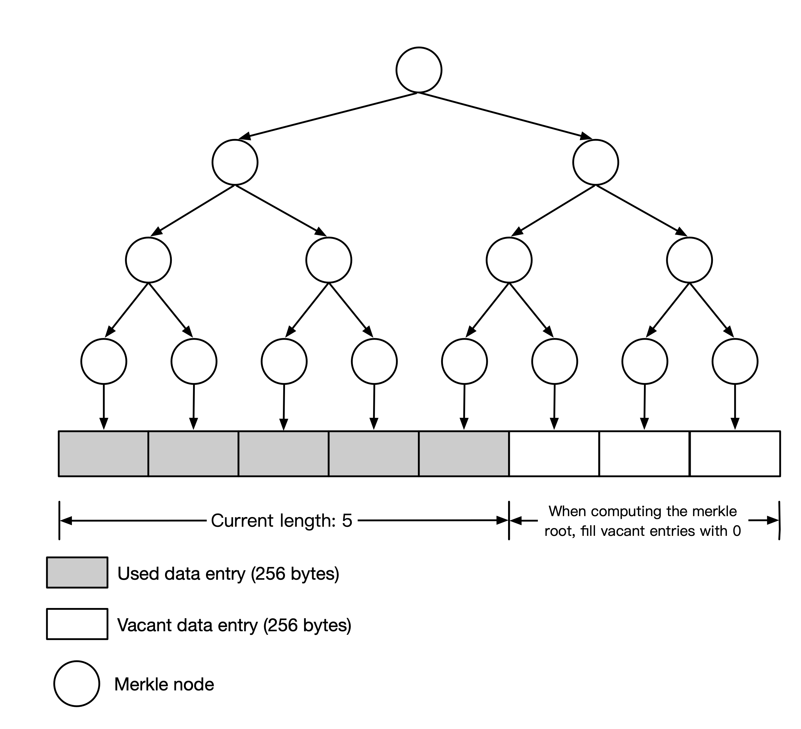

# Flow Design

The underlying structure of storage is called _**Flow**_. Flow is a continuously appended list of _**sectors**_, with each sector being a 256-byte data segment. The data submitted by users will be converted into several consecutive sectors. Users need to upload the metadata of the submission to the _**storage contract**_, which will then allocate the starting position in the Flow for the submission. Afterward, users will send the actual data to the _**storage nodes**_ in the 0g network.

(Note: Concepts like "file" and "segment" are abstracted at a higher level and are not considered within the scope of Flow.)

## The Merkle tree over the Flow

A Merkle tree is constructed based on Flow, and the storage contract will maintain the root of the Merkle tree. Since users only submit metadata instead of the complete data to the contract, both the structure of the Merkle tree and the submission metadata are specially designed.

### The Merkle root

The Merkle root over the Flow is defined as padding the flow with zeros until the number of sectors is a power of 2. Then, compute the keccak256 hash of each sector, and use keccak256 to calculate the Merkle root of these hashes. The diagram below illustrates an example of a flow with 5 sectors.

<figure><figcaption><p>Example: a flow with 5 data sectors.</p></figcaption></figure>

### Submissions

Since users only upload metadata to the storage contract, certain constraints must be met to ensure that the contract can correctly maintain the Merkle root: The user must pad the original data with zero bytes until it meets the submission conditions.

A submission consists of several concatenated sector arrays that must adhere to the following:

* Each sector array's length must be a power of 2, and the lengths of these sector arrays must decrease strictly monotonically.
* The length of the longest sector array must not exceed 8 times the length of the shortest sector array.

The metadata for a submission includes:

* The size of the original data in bytes
* The Merkle root and length of each sector array

The hash of the submission is defined as:

* The keccak256 hash of the concatenate for each sector array‘s Merkle root.

This approach ensures that:

1. The user's submission is always composed of several Merkle trees over the subtrees within the Flow, providing the Merkle root.
2. The user's submission will not be excessively long.

When receiving submissions, the contract will pad the Flow with zeros to ensure that the start position aligns with the length of the first sector array. For example, if the first sector array contains 64 elements, the submission should be aligned to a 64-element boundary.

#### Padding for a submission

Here we provide a concrete algorithm for padding the original data to be a valid submission

* Let $$m$$ be the number of bytes for _data_ to be submitted.
* Let $$n=\lceil m/\texttt{sector\_size}\rceil.$$
* Let $$k$$ be the minimum integer such that $$n<2^k$$.
* Let $$d=\max(1,2^{k-4})$$.
* Binary decompose $$\lceil n/d\rceil$$ to $$(c_1,c_2,\cdots)$$
  * For example, 13 can be decomposed to (8, 4, 1)
* Right pad _data_ with 0 to make its length matches $$(c_1+c_2+\cdots)\cdot d\cdot \texttt{sector\_size}$$ bytes.
* Divide _data_ into several chunks with $$c_1\cdot d,c_2\cdot d,\cdots$$ sectors respectively.

## Proof of Random Access

_**PoRA**_ (Proof of Random Access) is the mining algorithm for storage nodes. It periodically issues tasks requiring storage nodes to read the stored data and compute a hash value. When the hash value is below a specified threshold, the node finds a solution and submits the relevant content to the blockchain to claim a reward.

### List of parameters

Constant parameters

| Parameter         | Requirement                    | Current value              |
| ----------------- | ------------------------------ | -------------------------- |
| SECTOR\_SIZE      | Power of 2                     | 256                        |
| SEAL\_SIZE        | Power of 2, ≥ SECTOR\_SIZE     | 4 \* 2^10 (4 KB)           |
| SCRATCHPAD\_SIZE  | Power of 2, ≥ SEAL\_SIZE       | 64 \* 2^10 (64 KB)         |
| LOADING\_SIZE     | Power of 2, ≥ SCRATCHPAD\_SIZE | 256 \* 2^10 (256 KB)       |
| PRICING\_SIZE     | Divided by LOADING\_SIZE       | 8 \* 2^30 (8 GB)           |
| MAX\_MINING\_SIZE | Divided by PRICING\_SIZE       | 8 \* 2^40 (8 TB)           |
| EPOCH\_INTERVAL   | ≥ 10 minutes                   | 1200 blocks (about 1 hour) |

Also we can derive the following parameters

| Parameter           | Definition                      | Current value              |
| ------------------- | ------------------------------- | -------------------------- |
| SECTORS\_PER\_SEAL  | SEAL\_SIZE/ SECTOR\_SIZE        | 16                         |
| SECTORS\_PER\_PAD   | SCRATCHPAD\_SIZE/ SECTOR\_SIZE  | 256                        |
| SECTORS\_PER\_LOAD  | LOADING\_SIZE/ SECTOR\_SIZE     | 1024                       |
| SECTORS\_PER\_PRICE | PRICING\_SIZE/ SECTOR\_SIZE     | 32 \* 1024 \* 1024         |
| SECTORS\_PER\_MINE  | MAX\_MINING\_SIZE/ SECTOR\_SIZE | 32 \* 1024 \* 1024 \* 1024 |

Admin adjustable parameters

| Parameter       | Requirement | Default value                | Code                                                                                                                                                                                                                                                     |
| --------------- | ----------- | ---------------------------- | -------------------------------------------------------------------------------------------------------------------------------------------------------------------------------------------------------------------------------------------------------- |
| TARGET\_BLOCKS  | ≥ 2 minutes | 100 blocks (about 5 minutes) | [https://github.com/0glabs/0g-storage-contracts/blob/b67c1d325835898f5d5d8cda029dd30ebd1a9910/contracts/miner/Mine.sol#L235](https://github.com/0glabs/0g-storage-contracts/blob/b67c1d325835898f5d5d8cda029dd30ebd1a9910/contracts/miner/Mine.sol#L235) |
| TARGET\_SUBMITS | > 0         | 10                           | [https://github.com/0glabs/0g-storage-contracts/blob/b67c1d325835898f5d5d8cda029dd30ebd1a9910/contracts/miner/Mine.sol#L239](https://github.com/0glabs/0g-storage-contracts/blob/b67c1d325835898f5d5d8cda029dd30ebd1a9910/contracts/miner/Mine.sol#L239) |
| ADJUST\_RATIO   | > 0         | 20                           | [https://github.com/0glabs/0g-storage-contracts/blob/b67c1d325835898f5d5d8cda029dd30ebd1a9910/contracts/miner/Mine.sol#L246](https://github.com/0glabs/0g-storage-contracts/blob/b67c1d325835898f5d5d8cda029dd30ebd1a9910/contracts/miner/Mine.sol#L246) |

### Mine context

The process of PoRA is not working all the time. It is activated by L1 blocks periodically. For every `EPOCH_INTERVAL` blocks, a mine context will be released by the _**storage mine contract.**_ All the miners will work on PoRA to find valid solutions. Once `TARGET_SUBMITS` solutions are submitted, the miners stop PoRA until the next trigger. This can avoid making the miners’ disk busy all the time.

A mining context will be made with the following fields:

* `epoch` the index of the context
* `blockNumber` the block number of the block triggering PoRA
* `blockDigest` the hash value of the block triggering PoRA
* `flowRoot` the Merkle root of the Flow
* `flowLength` the number of sectors in the Flow
* `digest` (referred as _**Context Digest**_) the keccak256 hash of (`blockDigest`, `flowRoot`, `flowLength`)

### Registration

Miners must register in the smart contract to obtain a `minerId` for PoRA. The mine contract will generate a random ID for the miner’s on-chain address. Miners can change their miner ID at any time by requesting a new ID.

In the latest version of the storage node, the node will automatically check and request an ID upon startup.

In future versions, the rewards earned by the same miner ID may be capped.

### Data sealing

To ensure that each miner ID independently stores a copy and to maintain the total number of copies in the storage network, PoRA introduces a data sealing mechanism. Unlike Filecoin, the sealing and unsealing processes do not involve heavy cryptographic computations. Instead, they are designed to ensure that the cost of sealing and unsealing is higher than the cost of storage.

The data is sealed at every `SEAL_SIZE` byte. The sealed data is computed by

* the raw data `unsealed` in the Flow,
* the `minerId`,
* the index of the first sector in `unsealed` (should be in alignment of `SEAL_SIZE / SECTOR_SIZE`)
* the digest `contextDigest`of the first context whose `flowLength` covers the whole `unsealed`.

`unsealed` is regarded as an array of 32-byte elements and is sealed by

\<aside> 💡 By default, all integers are in 256-bit big-endian format when computing hash values.

\</aside>

```python
sealed[0] = unsealed[0] ^ keccak256(minerId, contextDigest, index)
sealed[i] = unsealed[i] ^ keccak256(sealed[i-1])
```

The sealing process is sequential and the unsealing process is parallel-able. A node can answer a part of the data without unsealing the whole chunk.

### Calculate loading chunks

The general process of PoRA involves the following steps:

1. Based on some on-chain seeds (such as a context digest) and a user-provided nonce, a recall position is computed through a CPU-intensive task.
2. The miner mixes the loaded data at the recall position with the intermediate results of this CPU-intensive task to calculate the final hash.

As the Flow data grows to the terabyte (TB) level or higher, a single node may be unable to store all the data. If many recall positions are not stored by the node, PoRA will shift from challenging data retrieval to challenging CPU capacity, which contradicts the design's original intent.

#### Recall Range

To address this, PoRA allows users to specify a recall range, which influences the calculation of the recall position. The miner can specify the mining range with two parameters:

* `startPosition` The index of the start sector.
* `miningLength` The length of sectors for mine range.
* A 64-bit binary number with wildcard characters, for example: `0011xx001x`, where `x` represents either 0 or 1. This number is specified with two fields
  * `shardId`: replace all the wildcard with 0
  * `shardMask`: replace all the wildcard with 1, and others to 0

The `shardDegree` of a recall range is defined by $$2^w$$, where $$w$$ refers to the number of wildcard characters.

The mining range should satisfy the following conditions:

* The `startPosition` should be in alignment of `SECTORS_PER_PRICE`
* The `miningLength` should not exceed `SECTORS_PER_MINE × shardDegree`
* `startPosition + miningLength` should not exceed the `flowLength` in the most recent context.
* `miningLength` should be no less than `min(x, SECTORS_PER_MINE × shardDegree)`, where $$x$$ is the largest multiply of `SECTORS_PER_PRICE` that is less than the `flowLength` in the mine context.

#### Recall Position

Consider a big integer `recallSeed` calculated from the CPU-intensive task. The recall position is calculated as

```python
originOffset = recallSeed % (miningLength / SECTORS_PER_LOAD)
recallOffset = (originOffset & shardMask) | range.shardId
if recallOffset * SECTORS_PER_LOAD > miningLength:
    /* recall position calculated fails */

recallPosition = startPosition + recallOffset * SECTORS_PER_LOAD;
```

### Iteration of PoRA

* Pick a random `nonce` with 32 bytes
* Get the current mining context with `flowLength` and `contextDigest`
*   Specify the mining range and calculated digest as

    ```python
    rangeDigest = keccak256(startPosition, miningLength, shardId, shardMask)
    ```
*   Compute recall position of PoRA chunk with a large Scratchpad `ScratchPad`

    ```python
    (recallSeed, scratchpad) = ScratchPadHash(minerId, nonce, contextDigest, rangeDigest)
    ```
* Regard `recallSeed` as a 256-bit big-endian format integer and calculate `recallPosition` as described in the previous section
* Load `LOADING_SIZE`-bytes sealed data started at `recallPosition` (in terms of sectors) as `sealedData`
* Let `mixedData` be `sealedData` xor `scratchpad`
*   Regard `mixedData` as an array of `SEAL_SIZE`-byte elements. For each segment `y` with index `i`, compute `poraHash` and check if it reaches `targetQuality`.

    ```python
    ZERO64 = 64 bytes filled with 0
    # The hash function here should be blake2b. 
    poraHash = Hash(i, minerId, nonce, contextDigest, startPosition, 
                    miningRange, ZERO64, y)
    difficultyScale = min(SECTORS_PER_MINE, flowLength) 
                    / min(SECTORS_PER_MINE, flowLength / shardDegree)

    if poraHash < poraTarget / difficultyScale:
        Found a valid solution (nonce, i) with respect to 
        (minerId, contextDigest, startPosition, miningRange)
    ```

#### Design of `ScratchPadHash` in PoRA

```python
# Initialize base_scratchpad with an array of 64-byte word. 
digest = blake2b(minerId, nonce, contextDigest, 
                 startPosition, miningLength) 

for i in range(0, SCRATCHPAD_SIZE / 64):
	  digest = blake2b(digest)
		base_scratchpad[i] = digest

recallSeed = keccak256(digest)

scratchpad = repeat base_scratchpad in LOADING_SIZE / SCRATCHPAD_SIZE times

return recallSeed, scratchpad
```

### Difficulty Adjustment

Once a `MineContext` is released at a specific block number, `TARGET_SUBMITS` valid solutions are expected to be submitted in exactly `TARGET_BLOCKS` blocks. Otherwise the `poraTarget` will be adjusted in the following steps.

* Decide the `actualBlocks` blocks as the actual time taken to submit `TARGET_SUBMITS` solutions. If there are not enough solutions until the next Mine Context release, the blocks between two context releases is defined as `actualBlocks`.
*   Adjust the `poraTarget`

    ```python
    expectedPoraTarget = poraTarget * actualBlocks / TARGET_BLOCKS
    poraTarget += (expectedPoraTarget - poraTarget) / ADJUST_RATIO
    ```

## Economic Model

### List of Parameters

Constant parameters

| Parameter      | Requirement | Default value |
| -------------- | ----------- | ------------- |
| DATA\_LIFETIME |             | 3 years       |

Admin adjustable parameters

| Parameter              | Requirement | Default value | Code                                                                                                                                                                                                                                                                             |
| ---------------------- | ----------- | ------------- | -------------------------------------------------------------------------------------------------------------------------------------------------------------------------------------------------------------------------------------------------------------------------------- |
| BASE\_REWARD           |             | 0             | [https://github.com/0glabs/0g-storage-contracts/blob/b67c1d325835898f5d5d8cda029dd30ebd1a9910/contracts/reward/ChunkRewardBase.sol#L99](https://github.com/0glabs/0g-storage-contracts/blob/b67c1d325835898f5d5d8cda029dd30ebd1a9910/contracts/reward/ChunkRewardBase.sol#L99)   |
| SECTOR\_PRICE          |             | 0             | [https://github.com/0glabs/0g-storage-contracts/blob/499963dc5dfd3ea92d2b7bdfe3773620cc87b120/contracts/market/FixedPrice.sol#L32](https://github.com/0glabs/0g-storage-contracts/blob/499963dc5dfd3ea92d2b7bdfe3773620cc87b120/contracts/market/FixedPrice.sol#L32)             |
| SERVICE\_FEE\_RATE\_BP |             | 0             | [https://github.com/0glabs/0g-storage-contracts/blob/b67c1d325835898f5d5d8cda029dd30ebd1a9910/contracts/reward/ChunkRewardBase.sol#L103](https://github.com/0glabs/0g-storage-contracts/blob/b67c1d325835898f5d5d8cda029dd30ebd1a9910/contracts/reward/ChunkRewardBase.sol#L103) |

### Pricing

When users submit data, they need to pay a fee based on the size of the submission, calculated as `SECTOR_PRICE × <number of sectors in the submission>`. The zeroes padded after the original data to meet the submission requirements are also subject to fees. However, zeroes padded before the original data by the storage contract to achieve alignment requirements do not incur any fees.

Although the pre-padded zeroes do not incur fees, the fees paid by the user will be evenly distributed across sectors, including the original data and all the zero padded part.

### Reward Bucket

Every `PRICING_SIZE` bytes of data in the Flow form a pricing chunk, which has a reward bucket, collecting the fees for each sector within this chunk. When a pricing chunk is filled with data, its rewards in that buckets are released linearly over a period defined by `DATA_LIFETIME`.

When PoRA's `recallPosition` hits a pricing chunk, it will take half of the "remaining released rewards.”

### System Rewards

In the early stages of the ecosystem, the foundation can reserve a portion of tokens for system rewards. When PoRA’s `recallPosition` hits a pricing chunk that is "releasing rewards", an additional reward of `BASE_REWARD` will be issued.

The funds for the base reward will be manually deposited into the reward contract and tracked separately. If the balance for the base reward is insufficient to cover a signle base reward, miners will not be able to receive the full base reward.

### Service Fee

A system service fee is charged as a proportion of the storage fees paid by the user, according to the parameter `SERVICE_FEE_RATE_BP`.
